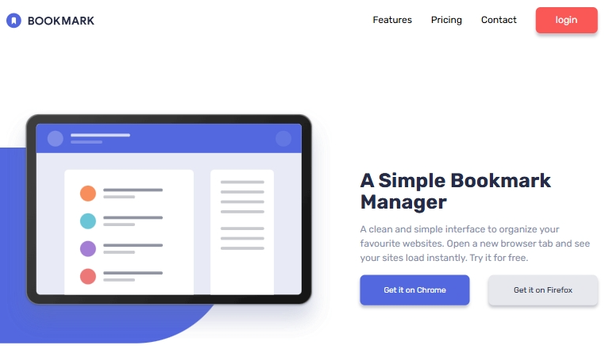

# Frontend Mentor - Bookmark landing page solution

This is a solution to the [Bookmark landing page challenge on Frontend Mentor](https://www.frontendmentor.io/challenges/bookmark-landing-page-5d0b588a9edda32581d29158). Frontend Mentor challenges help you improve your coding skills by building realistic projects. 

## Table of contents

- [Overview](#overview)
  - [The challenge](#the-challenge)
  - [Screenshot](#screenshot)
  - [Links](#links)
- [My process](#my-process)
  - [Built with](#built-with)
  - [What I learned](#what-i-learned)
- [Author](#author)

## Overview

### The challenge

Users should be able to:

- View the optimal layout for the site depending on their device's screen size
- See hover states for all interactive elements on the page
- Receive an error message when the newsletter form is submitted if:
  - The input field is empty
  - The email address is not formatted correctly

### Screenshot



### Links

- Solution URL: [Add solution URL here](https://github.com/dimitrisdr/bookmark-landing-page.git)
- Live Site URL: [Add live site URL here](https://dimitrisdr.github.io/bookmark-landing-page/)

## My process

### Built with

- Semantic HTML5 markup
- CSS custom properties
- Flexbox
- CSS Grid
- Mobile-first workflow


### What I learned


To see how you can add code snippets, see below:

```html
<ul class="nav-items">
  <li class="nav-item"><a href="#" class="nav-item__link">Features</a></li>
  <li class="nav-item"><a href="#" class="nav-item__link">Pricing</a></li>
  <li class="nav-item"><a href="#" class="nav-item__link">Contact</a></li>
  <li class="btn red-btn nav-item btn-nav-item"><a role="button" href="#" class="nav-item__link border-wh-thick">login</a></li>
</ul>
```
```css
.features-item__link::after {
    content: '';
    position: absolute;
    left: 0;
    width: 100%;
    height: 3px;
    top: calc(100% + (var(--global-padding) / 2 ) + 1.5px);
    border-radius: 100vw;
    z-index: 100;
    background-color: var(--Soft-Red);
    transform: scale(0,1);
    transform-origin: right;
}

.features-list__item:hover .features-item__link {
    color: var(--Soft-Red);
    transition: color 0.2s ease-in;
}

.features-list__item[aria-checked="true"] .features-item__link::after {
    transform: scale(1, 1);
    transition: transform 0.2s ease-in;
}

.features-list-categories__item {
    margin-top: var(--global-padding);
}

.features-list-categories__item[aria-hidden="false"] {
    animation: show 0.5s linear;
}
```

## Author

- Frontend Mentor - [@dimitrisdr](https://www.frontendmentor.io/profile/dimitrisdr)
